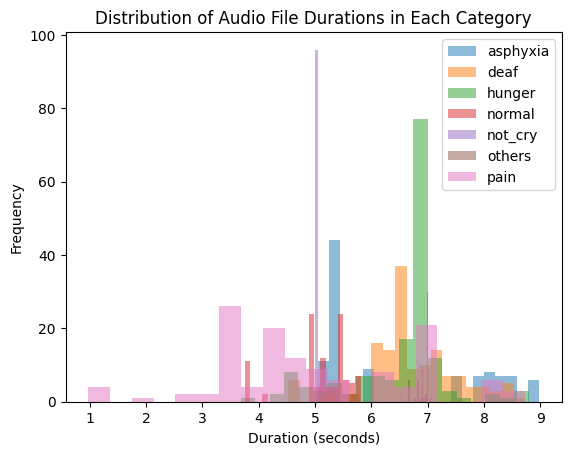

# 
Automatic Infant Cry Audio Classification for Differentiating Infant Cries Indicating Discomfort

  

## Table of content
--------------
1. [Introduction](#introduction)
2. [About Dataset](#about_dataset)
3. [Data Preprocessing and Understanding Workflow](data_preprocessing_and_understanding_workflow)
4. [About Important Tools Libraries Used In This Project](#About_important_libraries_used_in_this_project)

## Introduction
--------------
Infant crying is the **physiological** action that infants use to reflect their **physical**, **medical**, or **emotional** state to the outside world. Although infant cries seem to like each other, the physiological formation of crying includes different characteristics. Experienced parents, doctors, or nurses can perceive these differences based on their past experiences. Various features in the signal of infant cry provide information not only about the physical needs of the baby but also about medical issues such as **developmental disorders**, **autism**, and **chromosomal abnormalities**. This project aims to classify the **discomfort** that a infant is suffering from by analyzing the pattern of their crying audio. A small survey was done within friends and family to know weather educated adults can audibly distinguish different types of cries, and it was determined that crying types can be distinguished auditory. But we found that training human perception is a much more difficult and longer process than training machine learning algorithm to classify the discomfort type using infant crying audio.  The machine learning-based process can provide support to **parents**, **caregivers**, and **physicians** as it provides **low-cost**, **non-invasive**, **low-risk**, and **higher success**. 

## About Dataset
----------------
* The dataset used is combination of two datas sources.
* About **FIRST** source.
* The data is taken from **Infant Cry Audio Corpus**.
* An infant cry audio corpus that has been built through the **Donate-a-cry** campaign (no longer active).
* Also it include some extra data taken from kaggle.
* - [Data_source_1](https://www.kaggle.com/datasets/sanmithasadhish/infant-cry-dataset)
* - [Data_source_2](https://www.kaggle.com/datasets/warcoder/infant-cry-audio-corpus)
* The database is published under the **ODbL**.
* **File naming convention**
* One can visit the [Naming Convention](https://github.com/gveres/donateacry-corpus) github repository -> README.md to understand naming convention.
* About **SECOND** source.
* The other data source is **"Baby Chillanto Database"**
* Baby Chillanto Data Base is a property of **“Instituto Nacional de Astrofisica Optica y Electronica – CONACYT, Mexico”.**
* “We like to thank **Dr. Carlos A. Reyes-Garcia**, **Dr. Emilio Arch-Tirado** and his INR-Mexico group, and **Dr. Edgar M. Garcia- Tamayo** for their dedication of the collection of the Infant Cry data base.
* cited to **“Orion Fausto Reyes-Galaviz, Sergio Daniel Cano-Ortiz, Carlos Alberto Reyes-García. &quot;Evolutionary-Neural System to Classify Infant Cry Units for Pathologies Identification in Recently Born Babies&quot;. Proceedings of the Special Session MICAI 2008, Pg. 330-335. Eds. Alexander Gelbukh &amp; Eduardo Morales. IEEE Computer Society. ISBN: 978-0-7695-3441-1.”**
* **NOTE** WE CANNOT MAKE DATASET PUBLICALLY AVAILABLE DUE IT's LICENSE.
* To get the above mention dataset you can mail to **kargaxxi@inaoep.mx**
* Below is data category and number of audio files that we have for each category.

  

* Below is distribution of audio length for each cartegory.

  

## Data Preprocessing and understanding Workflow
------------------------------------------------

* You can go through [main_working.ipynb](Automatic_Infant_Cry_Audio_Classification/Research/main_working.ipynb) to understand **EDA**, **Feature Extraction**, **Model Development and evaluation** and **Model Selection** which we have done roughly before developing end-to-end project.

* You can reffer [Understanding MFCC](https://www.youtube.com/watch?v=4_SH2nfbQZ8&t=0s) to learn an important concept which is in general used in feature extraction of audio data.

## About Important Tools and Libraries Used In This Project
-----------------------------------------------------------
1. **Librosa**

 
&nbsp;&nbsp;&nbsp;

Librosa is a Python package for music and audio analysis. It provides tools for a variety of tasks related to audio processing, feature extraction, and analysis. Librosa is widely used in the fields of music information retrieval, audio signal processing, and machine learning for audio applications.

Some key features and functionalities of librosa include:

1. **Audio Loading:** Librosa allows you to load audio files in various formats and provides functions to manipulate and extract information from them.

2. **Feature Extraction:** It provides tools for extracting various audio features such as Mel-frequency cepstral coefficients (MFCCs), chroma feature, spectral contrast, and more. These features are commonly used for audio analysis and machine learning applications.

3. **Time-Frequency Representations:** Librosa allows you to create time-frequency representations of audio signals, such as spectrograms and chromagrams, which are useful for visualizing and analyzing the frequency content of audio over time.

4. **Beat and Tempo Analysis:** Librosa includes functions for beat tracking and tempo estimation, which are essential for music analysis.

5. **Pitch Estimation:** It provides tools for estimating pitch and harmonic content in audio signals.

6. **Time-Domain and Frequency-Domain Manipulation:** Librosa allows you to manipulate audio signals in both the time and frequency domains.

7. **Machine Learning Integration:** Librosa is often used in conjunction with machine learning libraries for audio classification, genre recognition, and other audio-related tasks.

Librosa simplifies many of the complex tasks associated with audio analysis, making it easier for researchers, developers, and data scientists to work with audio data in Python. It's a valuable tool for anyone working on projects involving audio processing, music analysis, or machine learning with audio data.

You can visit official site with documenation here on [Librosa](https://librosa.org/doc/latest/index.html)

**Others**

 
&nbsp;&nbsp;&nbsp;

&nbsp;&nbsp;&nbsp;

&nbsp;&nbsp;&nbsp;

&nbsp;&nbsp;&nbsp;

&nbsp;&nbsp;&nbsp;

&nbsp;&nbsp;&nbsp;

&nbsp;&nbsp;&nbsp;

&nbsp;&nbsp;&nbsp;

&nbsp;&nbsp;&nbsp;

&nbsp;&nbsp;&nbsp;

&nbsp;&nbsp;&nbsp;

## Requirements:

1. setuptools==68.2.2
2. Adam Optimizer
3. categorical_crossentropy